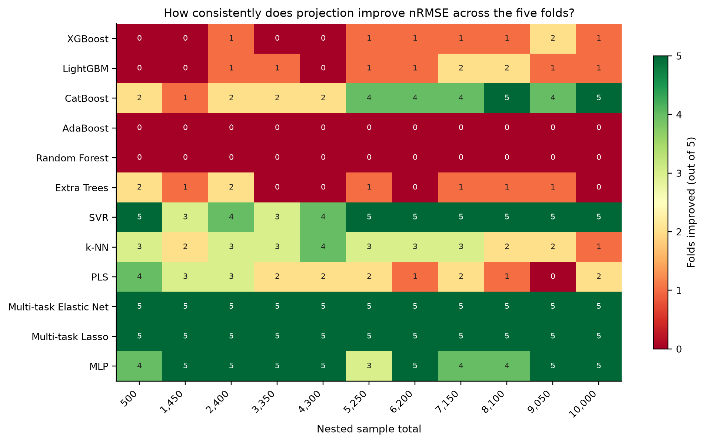
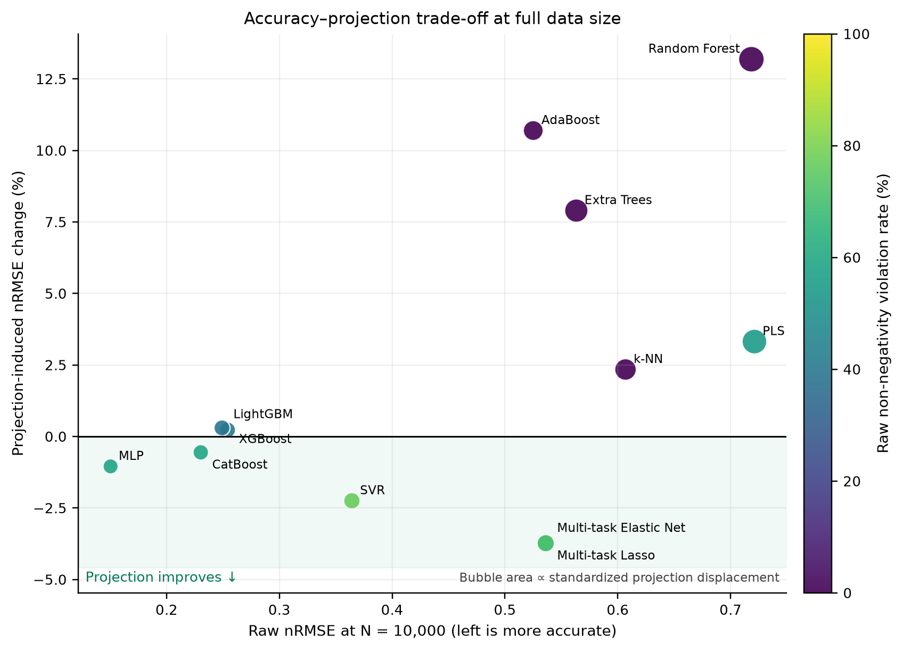
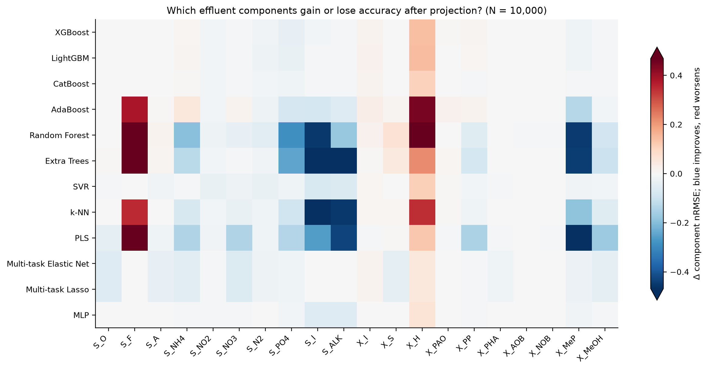
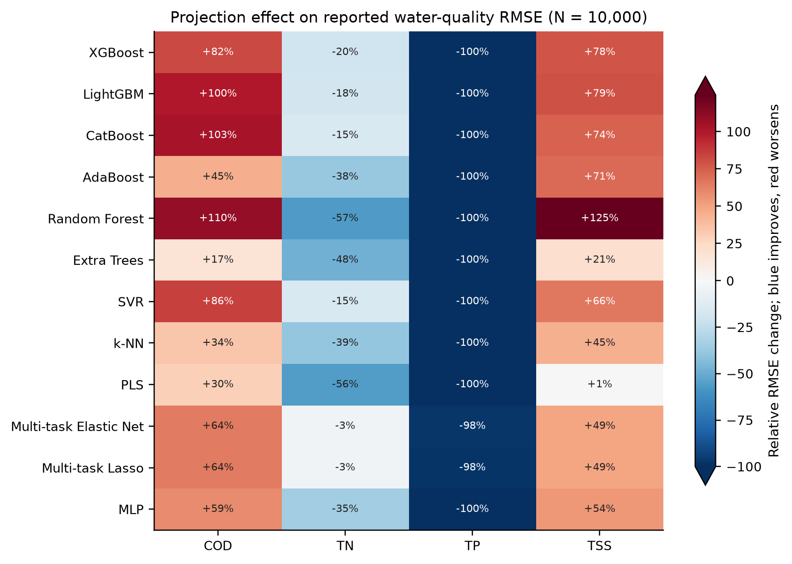
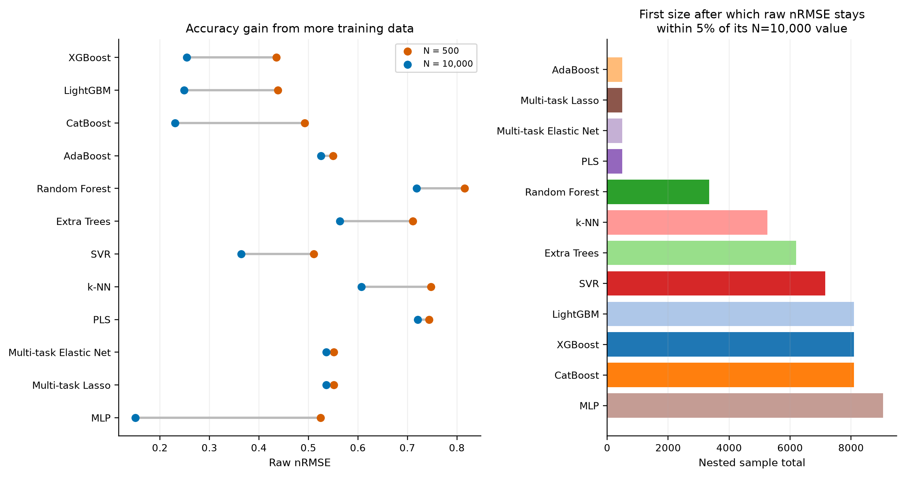

# Additional interim insights

> These analyses supplement the existing 01–07 figures without changing them. The live run remains partial; TabNet is not yet scored.

- Captured: 2026-07-22T00:13:28+08:00
- Manifest status/update: `running` / 2026-07-21T15:53:25.662071+00:00
- Complete models: 12 of 13 (XGBoost, LightGBM, CatBoost, AdaBoost, Random Forest, Extra Trees, SVR, k-NN, PLS, Multi-task Elastic Net, Multi-task Lasso, MLP)
- Fold files observed: 660 of 715

## 1. Fold-level consistency, not just mean direction

Projection improves the mean nRMSE in 41 of 132 complete model–size cells. The direction is unanimous across all five folds in 38 improving cells and unanimously adverse in 34 cells. This distinguishes stable effects from mean changes driven by only part of the cross-validation split.

## 2. Joint accuracy–physics trade-off

The physical contract remains exact in all 132 complete 12-model cells: raw mass-conservation violations occur for 100% of samples, while projected mass-conservation and non-negativity violation rates are both 0%. For the newly available MLP, the full-size raw non-negativity violation rate is 58.6%, reduced to 0% by projection.

MLP is currently the most accurate full-size model (raw nRMSE 0.150; projected 0.149). The largest relative projection benefit at full size is Multi-task Elastic Net (-3.7%), while the largest penalty is Random Forest (+13.2%). Bubble size shows how far projection moves the standardized prediction; color shows the raw non-negativity burden.

Across the 12 models, the descriptive Spearman association between raw non-negativity-violation rate and projection-induced error change is -0.90; the association between standardized displacement and error change is 0.64. Thus, heavier raw negativity tends to align with greater benefit, whereas larger corrective moves tend to align with larger accuracy penalties. These are cross-model descriptions, not causal or inferential results.

## 3. Component-level effects

Aggregate nRMSE can conceal opposing changes among the 20 effluent components. The heat map identifies where projection helps or harms each model.
For example, Random Forest improves 12 components but worsens overall because its losses for a few components—especially S_F and X_H—are much larger than its gains elsewhere. Component counts therefore cannot substitute for the equally weighted aggregate error magnitude.

| Model | Components improved | Components worsened |
|---|---:|---:|
| XGBoost | 14 | 6 |
| LightGBM | 14 | 6 |
| CatBoost | 16 | 4 |
| AdaBoost | 9 | 11 |
| Random Forest | 12 | 8 |
| Extra Trees | 12 | 8 |
| SVR | 16 | 4 |
| k-NN | 12 | 8 |
| PLS | 16 | 4 |
| Multi-task Elastic Net | 18 | 2 |
| Multi-task Lasso | 18 | 2 |
| MLP | 17 | 3 |

## 4. Consequences for reported water-quality quantities

The component-space projection does not affect COD, TN, TP, and TSS uniformly. The values below are relative changes in RMSE; negative values improve accuracy.
All 12 models improve TN and TP, while all worsen COD and TSS. TP RMSE falls by approximately 98–100%, consistent with the phosphorus-related invariant being enforced directly; this should be interpreted as a consequence of the physical contract rather than a general extrapolative accuracy result.

| Model | COD | TN | TP | TSS |
|---|---:|---:|---:|---:|
| XGBoost | +82.4% | -20.1% | -100.0% | +78.1% |
| LightGBM | +100.2% | -18.3% | -100.0% | +79.0% |
| CatBoost | +102.7% | -15.2% | -100.0% | +73.8% |
| AdaBoost | +44.8% | -37.7% | -100.0% | +70.6% |
| Random Forest | +109.5% | -56.8% | -100.0% | +124.5% |
| Extra Trees | +17.2% | -48.4% | -100.0% | +20.5% |
| SVR | +85.6% | -15.1% | -99.9% | +65.5% |
| k-NN | +34.4% | -38.9% | -100.0% | +44.6% |
| PLS | +29.6% | -55.7% | -100.0% | +0.7% |
| Multi-task Elastic Net | +64.5% | -3.4% | -97.6% | +49.0% |
| Multi-task Lasso | +64.5% | -3.4% | -97.7% | +49.0% |
| MLP | +58.7% | -34.6% | -100.0% | +53.8% |

## 5. Data efficiency

The dumbbells show the raw-error reduction from 500 to 10,000 observations. The right panel reports the first nested size after which performance remains within 5% of the final full-size value; it is a descriptive stabilization threshold, not an optimum.
MLP benefits most from added data (71.3% raw-nRMSE reduction from N=500 to N=10,000) and stabilizes latest by this rule (N=9,050). Conversely, early stabilization for AdaBoost, PLS, and the multi-task linear models reflects relatively flat learning curves, not necessarily high accuracy.

## Interpretation boundary

All results are in-distribution five-fold summaries from complete cells only. The run is still marked `running`; TabNet, OOD evaluation, final refits, and terminal assertions remain unavailable. No final 13-model ranking or extrapolation conclusion is justified yet.
