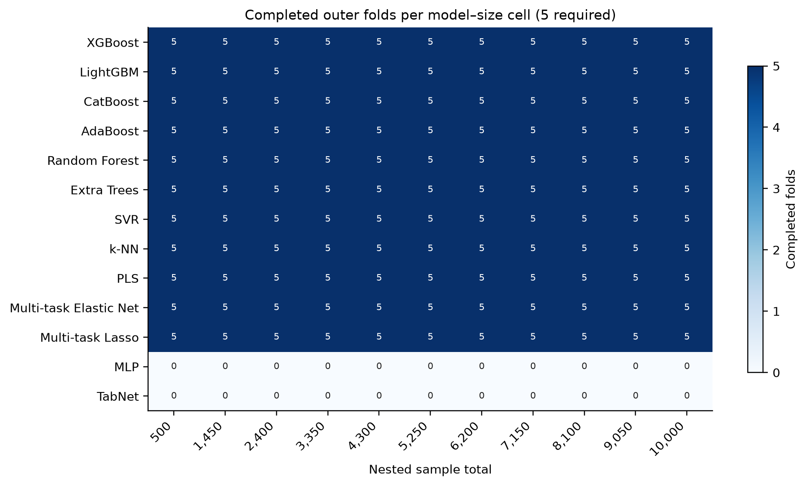
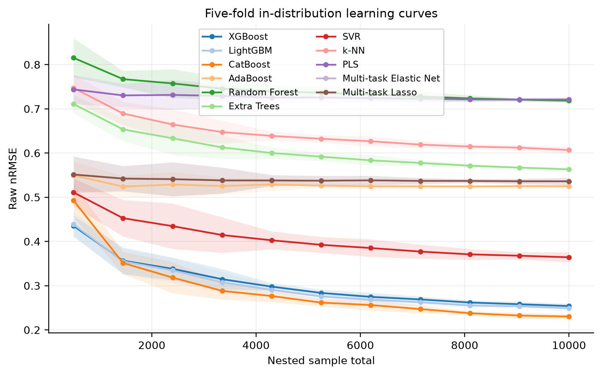
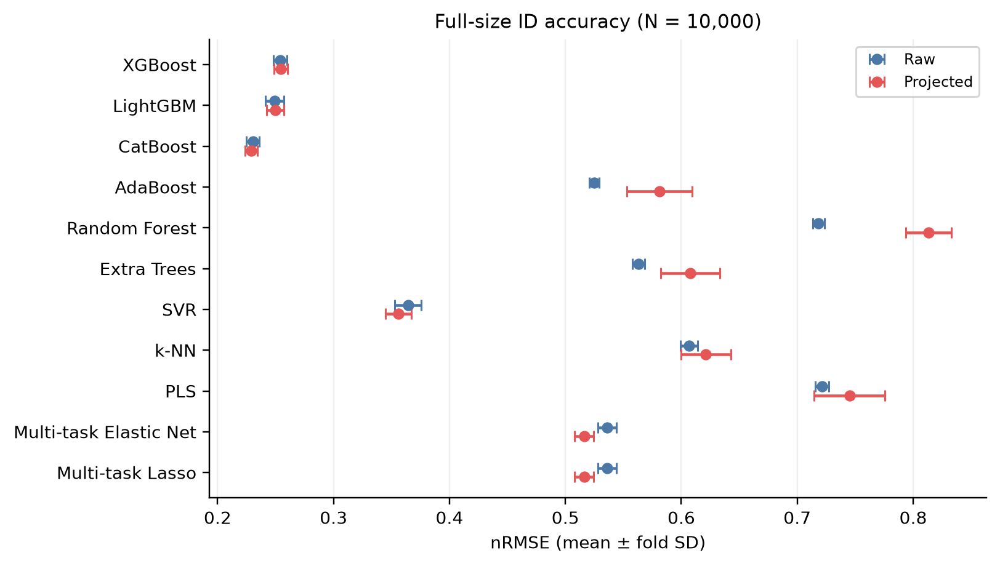
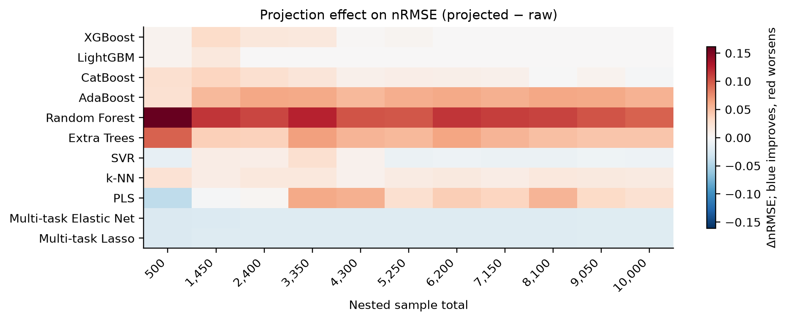
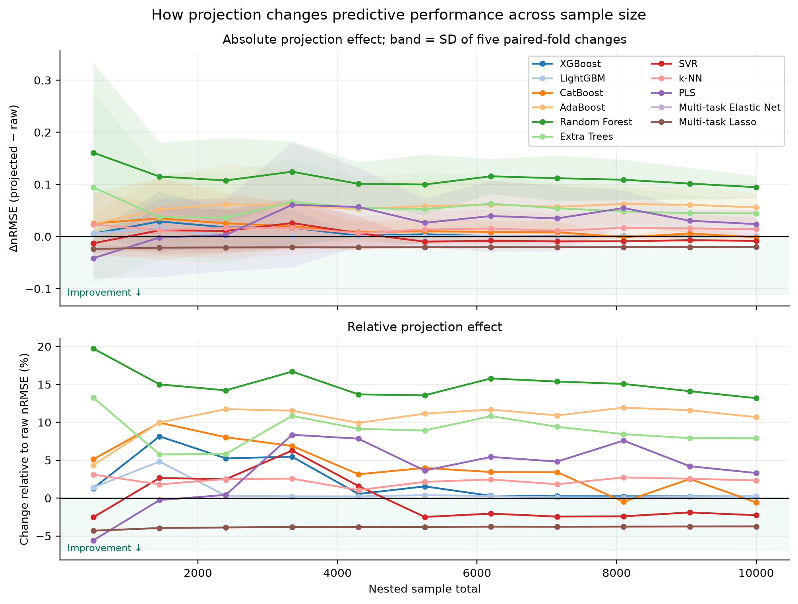
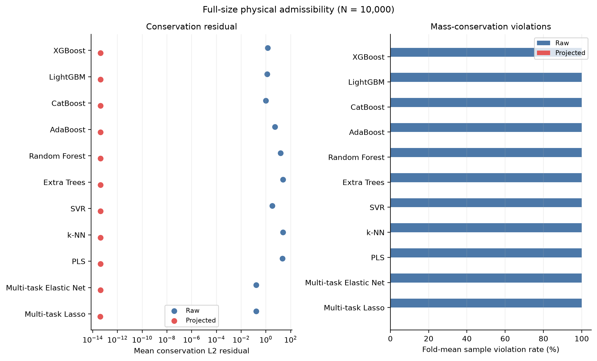
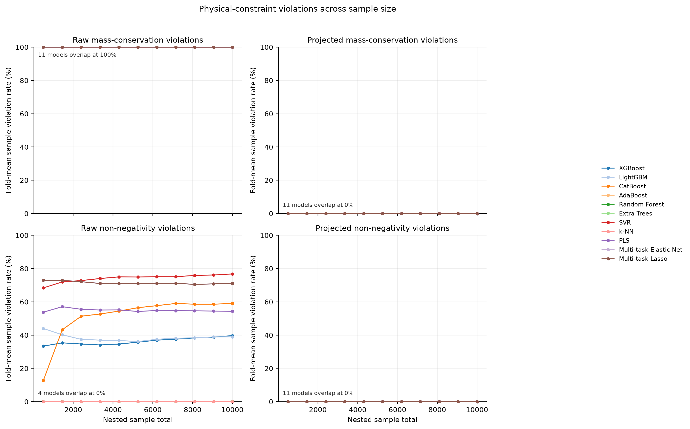

# Interim benchmark results

> **Partial, non-final evidence.** The source run was still marked `running` when captured. Only model–size cells with all five outer folds are used for means, standard deviations, and comparative claims.

- Run: `article_final_v2`
- Captured: 2026-07-21T15:50:23+08:00
- Manifest updated: 2026-07-21T07:43:31.078799+00:00
- Fold metric files observed: 605 of 715 planned (84.6%)
- Complete five-fold model–size cells: 121 of 143
- Fully comparable models across all 11 sizes: XGBoost, LightGBM, CatBoost, AdaBoost, Random Forest, Extra Trees, SVR, k-NN, PLS, Multi-task Elastic Net, Multi-task Lasso

## Main interim findings

The 11 completed models are compared across the nested training sizes. Their five-fold raw nRMSE curves are shown below; shaded regions are fold SD, not confidence intervals.

At the full in-distribution size, the available results are:

| Model | Raw nRMSE | Projected nRMSE | ΔnRMSE | Raw nMAE | Raw macro R² | Setup (s) | Raw latency (ms/sample) | Projection latency (ms/sample) |
|---|---:|---:|---:|---:|---:|---:|---:|---:|
| XGBoost | 0.254 ± 0.006 | 0.255 ± 0.006 | 0.001 | 0.124 | 0.935 | 12.5 | 0.0597 | 0.0976 |
| LightGBM | 0.249 ± 0.008 | 0.250 ± 0.007 | 0.001 | 0.120 | 0.938 | 4.0 | 0.0971 | 0.0840 |
| CatBoost | 0.230 ± 0.006 | 0.229 ± 0.006 | -0.001 | 0.113 | 0.947 | 33.3 | 0.0677 | 0.1235 |
| AdaBoost | 0.525 ± 0.004 | 0.581 ± 0.028 | 0.056 | 0.369 | 0.724 | 18.5 | 1.0310 | 0.0901 |
| Random Forest | 0.718 ± 0.005 | 0.813 ± 0.020 | 0.095 | 0.497 | 0.484 | 6.9 | 0.1376 | 0.0681 |
| Extra Trees | 0.563 ± 0.005 | 0.608 ± 0.025 | 0.044 | 0.387 | 0.683 | 2.8 | 0.1461 | 0.1053 |
| SVR | 0.364 ± 0.011 | 0.356 ± 0.011 | -0.008 | 0.198 | 0.868 | 56.0 | 1.8736 | 0.0922 |
| k-NN | 0.607 ± 0.007 | 0.621 ± 0.021 | 0.014 | 0.419 | 0.632 | 0.0 | 0.1574 | 0.1401 |
| PLS | 0.721 ± 0.006 | 0.745 ± 0.031 | 0.024 | 0.522 | 0.480 | 0.2 | 0.0010 | 0.1442 |
| Multi-task Elastic Net | 0.536 ± 0.008 | 0.516 ± 0.008 | -0.020 | 0.338 | 0.713 | 0.0 | 0.0011 | 0.1406 |
| Multi-task Lasso | 0.536 ± 0.008 | 0.516 ± 0.008 | -0.020 | 0.338 | 0.713 | 0.0 | 0.0010 | 0.1387 |

Across the 121 complete model–size cells, projection lowers mean nRMSE in 33 and raises it in 88. This confirms that physical enforcement and predictive accuracy are separate outcomes: the projection guarantee does not imply an accuracy gain.

The corresponding line trajectories below show both the absolute paired-fold change and the percentage change relative to raw nRMSE. Values below zero indicate improvement.

## Physical enforcement

Across all 121 complete model–size cells, raw mass-violation rates span 100.0%–100.0%. The maximum projected mass-violation rate is 0.0%, and the maximum projected non-negativity-violation rate is 0.0%. The largest cell-mean projected conservation L2 residual is 4.45e-14.

At N = 10,000, every available raw fold reports mass-conservation violations, whereas projected violation rates are zero. The projected mean conservation residuals are near floating-point precision. Full-size non-negativity violation rates are tabulated separately below.

| Model | Raw mass violation | Projected mass violation | Raw nonnegative violation | Projected nonnegative violation | Projected conservation L2 | Mean standardized displacement L2 |
|---|---:|---:|---:|---:|---:|---:|
| XGBoost | 100.0% | 0.0% | 39.72% | 0.00% | 4.25e-14 | 0.300 |
| LightGBM | 100.0% | 0.0% | 38.95% | 0.00% | 4.28e-14 | 0.301 |
| CatBoost | 100.0% | 0.0% | 59.06% | 0.00% | 4.21e-14 | 0.242 |
| AdaBoost | 100.0% | 0.0% | 0.00% | 0.00% | 4.17e-14 | 0.901 |
| Random Forest | 100.0% | 0.0% | 0.00% | 0.00% | 4.24e-14 | 2.002 |
| Extra Trees | 100.0% | 0.0% | 0.00% | 0.00% | 4.22e-14 | 1.528 |
| SVR | 100.0% | 0.0% | 76.78% | 0.00% | 4.21e-14 | 0.363 |
| k-NN | 100.0% | 0.0% | 0.00% | 0.00% | 4.22e-14 | 1.192 |
| PLS | 100.0% | 0.0% | 54.31% | 0.00% | 4.19e-14 | 1.808 |
| Multi-task Elastic Net | 100.0% | 0.0% | 71.06% | 0.00% | 4.17e-14 | 0.482 |
| Multi-task Lasso | 100.0% | 0.0% | 71.05% | 0.00% | 4.13e-14 | 0.482 |

Violation rates across all sample sizes are shown below. The projected panels use the same percentage definition as the raw panels.

## Interpretation boundary

Only complete five-fold model–size cells are included above. Models absent from the completeness map's five-fold rows are excluded from comparisons. OOD analyses and final fitted-model artifacts are unavailable while the run remains in progress, so no extrapolation conclusion or final 13-model ranking is warranted.

These figures are exploratory interim diagnostics and should not replace the manuscript placeholders until the run writes its completion sentinel and passes the terminal validation assertions.
